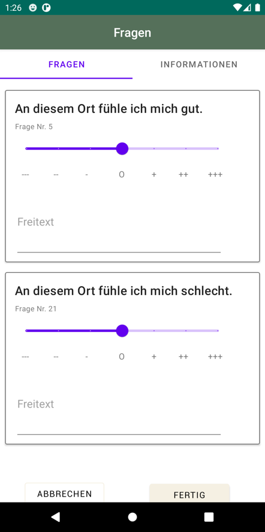
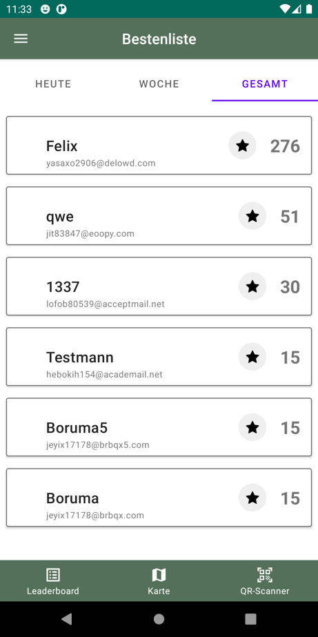
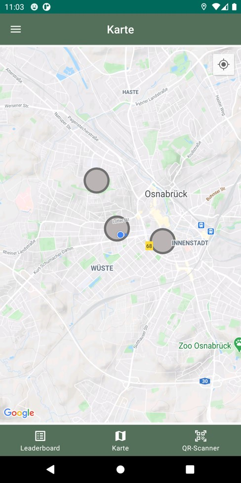
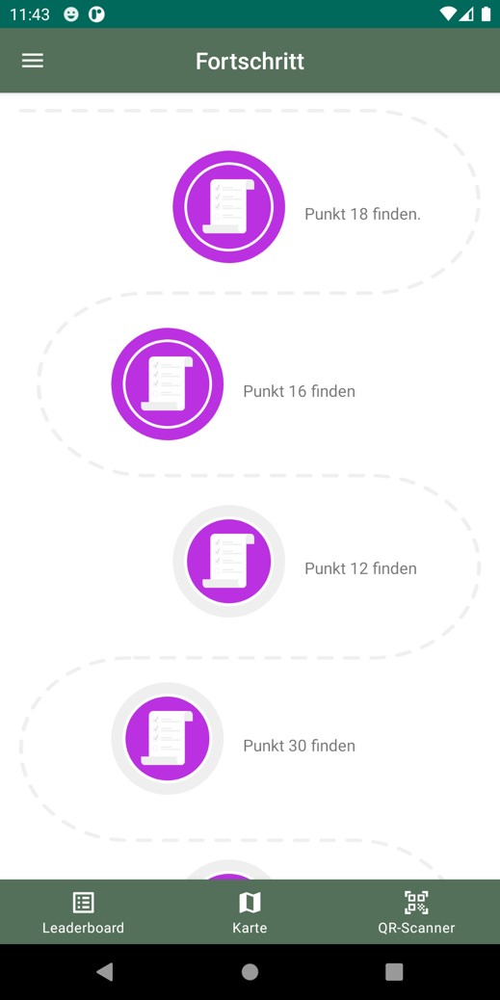

Emotions 
Open Source Project to collect Emotion Data from participants

1) PHP Laravel Backend and Webclient
2) Java Android Application 
 
 
Images From the Android Application:

  
  

  
  

